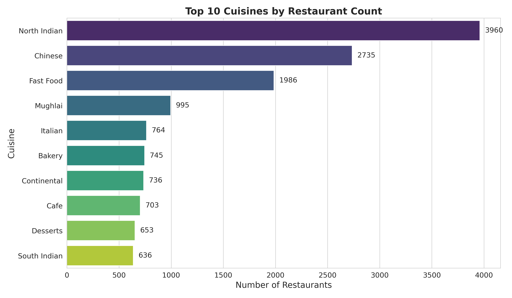
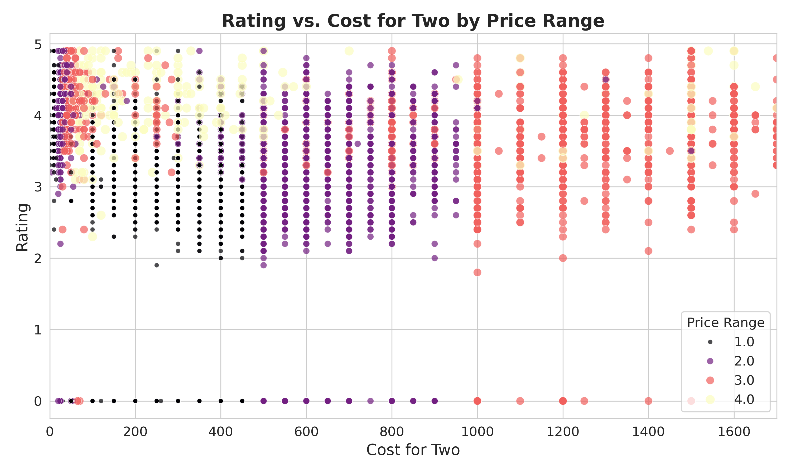

# Zomato_Analysis
Zomato Data Analysis Analyzed a dataset of 9,500+ Zomato restaurants using Python, Pandas, and Seaborn. Performed data cleaning, exploratory data analysis, statistical tests, clustering, and created professional visualizations.
## Key Features
- Cleaned data: Handled missing values, duplicates, and type conversions.
- EDA: Analyzed ratings, costs, cuisines, and geographic trends.
- Advanced Analysis: Conducted T-tests and K-means clustering.
- Visualizations: Generated static (Matplotlib/Seaborn) and interactive (Plotly) plots.

## Files
- `zomato_final.csv`: Final dataset with clusters.
- `enhanced_*.png`: Polished visualizations.
- `interactive_rating_vs_cost.html`: Interactive Plotly plot.
- `Zomato_Analysis.ipynb`: Full code.

## Tools
- Python, Pandas, Seaborn, Plotly, Scikit-learn
- Google Colab

